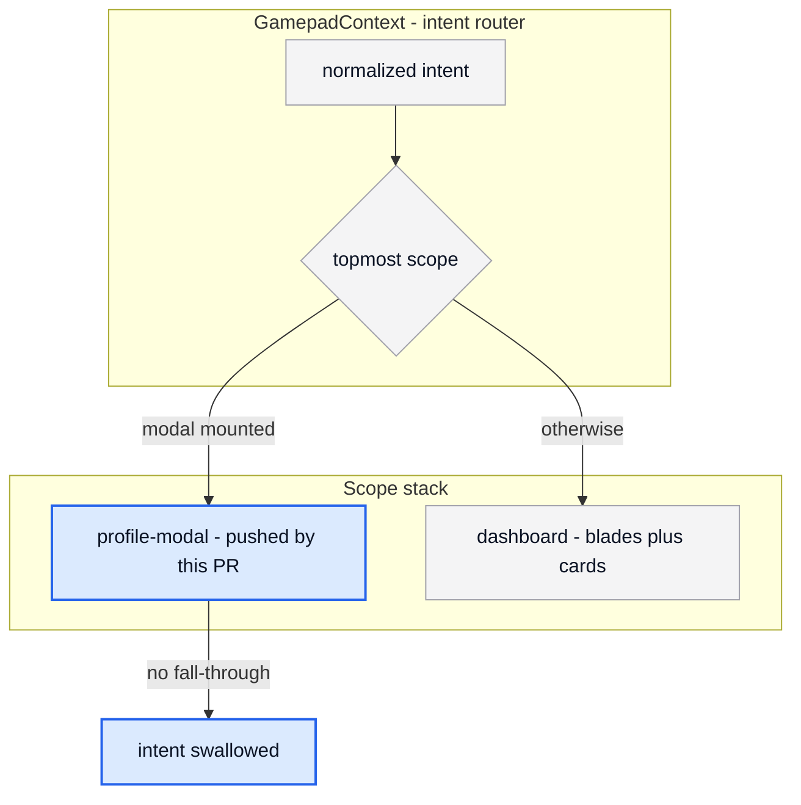

# Create Pull Request to Main

Create a pull request from the current branch to `main`.

A reviewer of this repo is usually another agent session or you, days later, with no
memory of the change. The body has to carry enough for them to trust the diff without
running it. That is what the Architecture and Evidence sections are for.

## Arguments

- `--draft`: open the PR as a draft
- `--no-diagram`: skip the Architecture section even if the diff qualifies

## Pre-flight Checks

1. **Verify branch state**
   - `git status` to confirm the working tree is clean
   - If there are uncommitted changes, ask whether to commit first
   - Committable work belongs in a worktree under `.claude/worktrees/`, never the repo root

2. **Check remote sync**
   - `git fetch origin main`
   - Push with `-u` if the branch is not on the remote

3. **Analyze the full scope, not the last commit**
   - `git log main..HEAD --oneline`
   - `git diff main...HEAD --stat`

4. **Decide whether this PR gets a diagram.** See [Architecture Diagram](#architecture-diagram).
   Decide from the diff, before drafting the body. Most PRs do not get one.

5. **Collect the evidence you will cite.** See [Evidence](#evidence). Run the checks now so
   the body reports what actually happened rather than what usually happens.

## PR Creation

```bash
gh pr create --base main --title "<title>" --body "$(cat <<'EOF'
## Summary
<1-3 bullets covering ALL commits in the PR, not just the last one>

## Architecture
<Mermaid diagram, ONLY if the PR qualifies. Omit this heading entirely otherwise.>

## Changes
<Key files and areas, grouped by concern>

## Evidence
<What was verified and how. See the Evidence section for what counts.>

## Verification
- [ ] `npm run typecheck`
- [ ] `npm run lint`
- [ ] `npm run lint:css` (no new warnings)
- [ ] `npm run lint:useeffect`

🤖 Generated with [Claude Code](https://claude.com/claude-code)
EOF
)"
```

## Architecture Diagram

GitHub renders Mermaid natively in fenced ` ```mermaid ` blocks, so a diagram costs nothing
to host and nothing to maintain. That makes it tempting to add one everywhere. Do not.

### When to include one

Include a diagram **only** when the diff shows at least one of:

- A new or changed **tRPC procedure**, or a change to how an existing one is reached
- A **Prisma schema** change: new model, new relation, new status column
- A change to **auth or gating**: who may call a procedure, what a guest may see
- A change to the **input scope stack**: which scope owns which intent, or how intents
  fall through. This repo's recurring bug class is two scopes competing for the same
  intent, and a diagram of the stack surfaces it during review instead of during play
- A flow crossing **two or more layers**: route plus router plus schema
- A **lifecycle** with states: toast entry and exit, achievement unlock and merge,
  gamepad connect and disconnect
- A **rendering or layering model** that prose cannot pin down: paint order, stacking
  contexts, which layer clips which

### When to skip

Skip, and omit the `## Architecture` heading entirely rather than writing "N/A":

- Single-component styling, copy edits, token additions, dependency bumps
- Refactors that move no boundary and change no flow
- Anything where the diagram would restate the Summary in boxes

A diagram on a PR that did not need one teaches reviewers to scroll past the ones that did.

### Choose the type from the shape of the change

| Change shape | Diagram | Typical case here |
|---|---|---|
| Request flow | `sequenceDiagram` | component to tRPC procedure to Prisma to Neon |
| Decision or gating | `flowchart TD` | intent dispatch, guest vs signed-in, mobile gate |
| Schema | `erDiagram` | migrations adding models or relations |
| Lifecycle | `stateDiagram-v2` | toast phases, achievement unlock, scope push and pop |
| Paint order | `flowchart TD` | background layers, stacking contexts, clipping |

Defaulting to a flowchart for everything produces shapes that parse but explain nothing.

### Rules

1. **Derive every node from the diff.** Each node must correspond to a file, procedure,
   model, scope id, or CSS layer present in `git diff main...HEAD`. Never draw from memory.
   A confidently wrong diagram is worse than none, because reviewers trust it.
2. **Distinguish new from existing.** Style changed nodes so the delta is visible at a
   glance. That is what makes it a PR diagram rather than a generic architecture diagram.
3. **Draw the trust boundary** whenever the PR touches a procedure or the schema. Group
   nodes into client, tRPC procedure, and Postgres subgraphs. Validation on the wrong side
   of that line is invisible in a diff and obvious in a diagram.
4. **Cap at about 12 nodes.** Overflow means the PR is too large or the diagram is pitched
   at the wrong altitude. It is not a rendering problem to solve with a bigger graph.
5. **Stay syntactically conservative.** Invalid Mermaid renders as a parse-error box in the
   PR body. Stick to the types above and their basic syntax. Quote labels containing
   punctuation.
6. **Make styling theme-safe.** GitHub renders Mermaid with a dark theme in dark mode, where
   a `classDef` that sets `fill` but not `color` gets light auto-text on a light fill and is
   unreadable for half your reviewers. Always pin both:

   ```
   classDef changed fill:#dbeafe,stroke:#2563eb,stroke-width:2px,color:#0b1324;
   ```

   Avoid `#` inside node label text, it can parse as a comment. Prefer ` - ` over dashes
   inside labels and edge captions.

7. **Follow the diagram with one line saying what the colors mean**, so the styling is
   legible without guessing.

### Example

A PR adding a scope that must swallow directional intents while a modal is open:

````markdown

````

Blue is added or changed by this PR.

Note what the stack conveys without prose: the modal does not filter intents, it owns them,
and the dashboard stops receiving anything while it is mounted.

## Evidence

This repo has no test runner. Storybook is the only interactive harness. So "tested" cannot
mean a green suite, and a reviewer cannot assume one. State what was actually checked:

- **Always**: the four verification commands, with their real result. If `lint:css` warnings
  changed, give the before and after counts for the files you touched.
- **Visual changes**: name the Storybook story that shows it, so the reviewer can open exactly
  the right one. If the change is geometric, give the numbers that make it checkable: sizes,
  ratios, breakpoints where the behavior differs.
- **Behavioral changes**: the reproduction. What to click, which viewport, which input mode,
  and what should happen.
- **Anything unverified**: say so plainly, in its own line. A PR that admits the visual check
  is outstanding is worth more than one that implies a check nobody ran. This matters most
  when the author is an agent that cannot open a browser.
- **Never** claim a check you did not run, and never soften a failure into a warning.

Evidence goes in the body as text. GitHub does not host images pasted through the API, so do
not link local screenshot paths, they render as broken images for everyone but you.

## Title Convention

Same convention as commits, since release-please reads them:

- `feat(<scope>): <description>` for features
- `fix(<scope>): <description>` for bug fixes
- `refactor(<scope>): <description>`
- `chore(<scope>): <description>`

For a mixed PR use the most significant type.

## Instructions

1. Run pre-flight checks
2. If the working tree is dirty, offer to commit first
3. Analyze all commits that will land, not just the newest
4. Decide whether the PR qualifies for a diagram, and pick the type from the change shape
5. Run the verification commands and record what they actually printed
6. Draft the title and body covering the full scope
7. Create the PR with `gh pr create`
8. Return the PR URL, then show the Post-Merge notes

## Edge Cases

- **Branch not pushed**: push first with `git push -u origin <branch>`
- **PR already exists**: show the existing URL rather than opening a second one
- **Conflicts with main**: warn and suggest rebasing before opening
- **Worktree**: remove it after the PR merges, not when the task ends

## Post-Merge

```
1. Merge with a merge commit or rebase-merge. Squash only on request: squashing a branch
   that still receives commits strands the later ones off main.

2. Vercel builds production from main automatically. Preview builds are skipped by the
   project's Ignored Build Step, so main is the only branch that produces a deployment.

3. release-please opens or updates its release PR from the conventional commits. Version
   bump and CHANGELOG land when that PR merges, not when this one does.

4. Remove the worktree and delete the local branch:
   git worktree remove .claude/worktrees/<name>
   git branch -d <branch>
```
